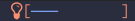
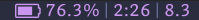
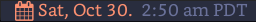
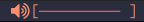

#+TITLE: slothbar

Slothbar is an X window manager status bar that runs within Emacs.

It is window manager agnostic, written completely in elisp, and fully
configurable in Emacs.

It has been tested with [[https://github.com/emacs-exwm/exwm][Exwm]], [[https://xmonad.org][xmonad]], [[https://herbstluftwm.org][herbstluftwm]], [[https://github.com/conformal/spectrwm][spectrwm]], [[https://stumpwm.github.io/][stumpwm]],
and [[https://i3wm.org/][i3]].

It is currently pre version 1.0 and the API is not yet stable.

Like Exwm, it relies on xcb via xelb to communicate with an Xorg server.

Current version: *0.30.2*

Note: *At present this requires Emacs 28.0*
If you would like it to work on Emacs 27, please let me know.

* Usage

To start slothbar, run =M-x slothbar-mode=. On first run, expect a delay
of around twenty to thirty seconds (more or less depending on which
fonts are chosen). During this time, available fonts configured in
=slothbar-font-candidates= are loaded and cached in a background process
for future reference.

At first there is an empty bar without any modules. The background
color will match the current Emacs background color.

** Displaying modules

The customizable variable =slothbar-modules= is a list of either
functions that return modules or one or more of the layout
instructions =:left=, =:right=, and =:center=. A module must satisfy the
predicate =slothbar-module-p=.

The following displays all the built-in modules with default settings:

#+begin_src emacs-lisp
  (require 'slothbar-module-requires)

  ;;; layout tray, date, and workspaces to the left, and wifi, volume,
  ;;; backlight, and battery to the right
  (setq slothbar-modules
        '(:left
          slothbar-tray-create slothbar-date-create
          slothbar-workspaces-create
          :right
          slothbar-wifi-create slothbar-volume-create
          slothbar-backlight-create slothbar-battery-create))
#+end_src

Eval the code above with slothbar running to see the results soon after.

Customizing slothbar-modules will automatically require
slothbar-module-requires.

Multiple instances of the same module may coexist. The following adds
an additional volume module to control microphone volume:

#+BEGIN_SRC emacs-lisp
  (setq slothbar-modules
        '(:left
          slothbar-tray-create slothbar-date-create
          slothbar-workspaces-create
          :right
          slothbar-wifi-create slothbar-volume-create
          (lambda ()
            (slothbar-volume-create :icon '((1 . ?󰍭) (110 . ?󰍬))
                                    :channel "Capture"
                                    :format "^8^f2^[^f4%i^]%p"))
          slothbar-backlight-create slothbar-battery-create))
#+END_SRC

** Fun or tiresome things to configure

+ =slothbar-height= the desired height in pixels
+ =slothbar-font-candidates= a list of lists where each inner element is
  a font name, highest preference first, and each outer element
  corresponds to format color codes =^f0=-=^f9=
+ =slothbar-is-bottom= set to =t= to position the bar on the bottom of the
  display
+ =slothbar-margin-y= margin in pixels for the gap between bar and struts
+ =slothbar-preferred-display= the name of the preferred display or nil
  to use the primary display
+ ~(slothbar-randr-mode)~ to enable multi-screen support

Modifications to height and font-candidates will reflect automatically
while slothbar is running.

Modifications to is-bottom, margin-y, and preferred-display take
effect with =M-x slothbar-refresh=.

** Minimal use-package

#+begin_src emacs-lisp
  (use-package slothbar
    :config
    (require 'slothbar-module-requires)
    (setq slothbar-modules '(:left slothbar-tray-create slothbar-date-create
                             slothbar-workspaces-create
                             :right slothbar-wifi-create slothbar-volume-create
                             slothbar-backlight-create slothbar-battery-create))
    ;; to enable multi-screen support
    (slothbar-randr-mode))

  ;;; then M-x: slothbar
  ;;; To exit:
  ;;; M-x: slothbar-exit
#+end_src

* Installation

Ensure that *xauth* is installed.

Install using [[https://github.com/quelpa/quelpa][quelpa]], [[https://github.com/radian-software/straight.el][straight.el]], or your favorite direct-from-source
package manager.

See the [[./slothbar.el][./slothbar.el]] Package-Requires header for a list of package
dependencies. All dependencies are available from either elpa or
melpa.

** Fonts
Check the default value of =slothbar-font-candidates= in
[[./slothbar-font.el][./slothbar-font.el]] to determine a minimal set of fonts.

E.g. if =slothbar-font-candidates= is:
#+BEGIN_SRC emacs-lisp
  '(("Aporetic Sans" "IBM Plex Serif" "Deja Vu Serif" "Cantarell")
    ("Font Awesome")
    ("Aporetic Sans Mono" "IBM Plex Mono" "DejaVu Sans Mono:style=Book")
    ("all-the-icons")
    ("Symbols Nerd Font Mono"))
#+END_SRC
then for module format strings using:
+ =^f0= ensure one of Aporetic Sans, IBM Plex Serif, Deja Vu Serif, or
  Cantarell is installed
+ =^f1= install the free version of font awesome
+ =^f2= ensure one of Aporetic Sans Mono, IBM Plex Mono, or Deja Vu Sans
  Mono is installed
+ =^f3= run =M-x all-the-icons-install-fonts= (or install another way)
+ =^f4= run =M-x nerd-icons-install-fonts= (or install another way)

Customize this variable if you prefer other fonts.

** With Guix

When using guix system/guix package manager to manage Emacs packages,
the below linked package definitions should work from a local channel:

[[./slothbar.scm.org][./slothbar.scm.org]]

Update commit references/tags to the desired revisions/tag names.

To compute the base32 hash, use a command like =guix hash -S nar .=
after checking out the desired revision.

Once the channel definition is updated, run =guix pull=.

Then, =guix install emacs-slothbar= should suffice to complete
installation.

* Synopsis of work in progress
** Now supported
+ Display at the top of the screen as window a dock window

+ Configurable horizontal module layout support left, center, right align

+ [[https://stumpwm.github.io/][Stumpwm]] like format/color code syntax for arranging module text, icon, and
  widget display

+ Rendering of OTF/TTF vector text and icon fonts via [[https://github.com/jollm/fontsloth][fontsloth]]

+ Mix fonts and conditionally change fonts within modules

+ Configurable zone colors to change icon or color text based on status

+ Module development API exists but is not yet finalized or particularly well
  documented

+ Act as the system tray (as of version 0.22.0)

+ Configuration for multiple screens/randr (currently may display on a
  preferred display in a multi screen configuration)

+ Dock on screen tops or bottoms

+ Help to locate/suggest/select compatible fonts to try (as of 0.26.0)

** Not currently supported (but planned)
+ Easy and meaningful integration with screen readers
+ Multiple bars and gaps like in Polybar
+ Configurable transparency
+ Investigate adding a render backend that uses a posframe-like window with a
  nil parent configured as a dock

  This would provide an easier path to eventually decoupling from X and allow
  for display in an actual Emacs frame (if desired). It would also allow for
  built-in font capabilities.
+ Animations

* Project organization
Slothbar consists of five primary components:
+ Status bar xcb lifecycle, refresh, and event handling
  Entry point: [[./slothbar.el][./slothbar.el]]

  This delegates to [[./slothbar-layout.el][./slothbar-layout.el]] to decide which window areas to
  copy/clear during a refresh cycle.

  This provides a minor mode, =slothbar-mode=
  + =M-x: slothbar-mode=: display/exit the status bar

+ Logical layout helpers
  Entry point: [[./slothbar-layout.el][./slothbar-layout.el]]

  Currently this produces horizontal layouts supporting combination of left,
  right, and center alignments of modules. It supports x and y coordinate
  offsets.

  The extents fns ~slothbar-layout-extents~ and
  ~slothbar-layout-subtract-extents~ allow for selective display update when the
  layout changes.

+ Port of Stumpwm like color command syntax
  Entry point: [[./slothbar-color.el][./slothbar-color.el]]

  These are stumpwm style color/font codes meaning that each module can have a
  format string to arrange its text/icon and allow control of fonts and colors
  for individual parts or segments.

  Not yet all the stumpwm commands have been implemented.

  Currently the following color code commands are supported:
  - :font, shorthand ^f[0-9]
    ~slothbar-font-candidates~ is customizable and maps 0-9 to font paths
  - :fg, shorthand ^[0-9]~?  ~slothbar-color-map-fg~ is customizable and maps
    0-9 to xcb colors The optional ~ suffix (not in stumpwm) indicates to apply
    the color locally, meaning only to non color commands preceding the next
    color command if any. This is implemented as an implicit :push :pop around
    applicable segments.
  - :push, shorthand ^[
    push the current fg and font onto the stack
  - :pop, shorthand ^]
    pop the stack and restore the previous fg and font
  - ^; (not in stumpwm) acts as a noop to separate non color command
    segments. it’s mostly useful in combination with ~ operator described above

+ Base module API

  *not yet finalized*

  Entry points:
  + [[./slothbar-module.el][./slothbar-module.el]]
  + [[./slothbar-module-.el][./slothbar-module-.el]]

  At present it consists of a cl-struct base type ~slothbar-module~ and a set
  of generic functions and default primary methods for dispatch on objects of
  that type.

  Generic functions (default primary method descriptions):
  + ~(slothbar-module-init (m slothbar-module))~: gives an xcb pixmap,
    graphics context, a glyphset, a cache, and fills a rectangle with
    the background color. Generally it is not necessary to override
    the default primary method. It may be helpful to provide before or
    after methods.

  + ~(slothbar-module-layout (m slothbar-module))~: relies on
    ~fontsloth-layout~, ~slothbar-color~, and ~slothbar-font~ to produce a
    sequence of color commands and glyph positions

  + ~(slothbar-module-refresh (m slothbar-module))~: if the module requests a
    refresh, draw the text using glyph positions and color commands

  + ~(slothbar-module-update-status (m slothbar-module))~: for modules
    that need to poll status information, if a module defines a
    primary method for this, it will run on a repeat timer until the
    module exits

  + ~(slothbar-module-exit (m slothbar-module))~: free xcb assets and clear
    module state

  Module implementations can provide specific :before and/or :after methods of
  the above as well as overrides to hook into the module
  init/layout/refresh/exit cycle.

+ Glyph rendering, loading, and compositing
  Entry point: [[./slothbar-render.el][./slothbar-render.el]]

  This is used by slothbar-module.el to draw text. It relies on [[https://github.com/jollm/fontsloth][fontsloth]] for
  glyph rasterization and provides an implementation of glyph stream like
  functionality that is normally in xcb-render-util but is not included in xelb
  in order to support CompositeGlyphs32 requests for loaded glyphs.

* Usage caveats
+This probably doesn’t work well with multiple screens at the moment.+
It's tested in multi-monitor setups so far in EXWM and should work in
herbstluftwm and xmonad.

+It’s not great at helping to find fonts.+ See the
=slothbar-font-candidates= docstring in [[./slothbar-font.el][./slothbar-font.el]].

It depends on fontsloth which is another project in very early stages; see the
fontsloth README linked above for a list of tested fonts.

*The module and layout APIs are not yet finalized as such configuration
procedures and customization options may change prior to a 1.0 release.*

* Screen(s)
These are using Bookerly-Regular for variable text, IBMPlexMono for monospace,
and Font Awesome 5 (the one that comes with all-the-icons) for icons:

#+CAPTION: 

#+CAPTION: backlight module
[[./screen-backlight-2.png]]

#+CAPTION: 

#+CAPTION: battery module
[[./screen-battery-2.png]]

#+CAPTION: 

#+CAPTION: date module (fall and summer)
[[./screen-date-2.png]]

#+CAPTION: 

#+CAPTION: 
[[./screen-volume-2.png]]

#+CAPTION: volume module
[[./screen-mic.png]]

#+CAPTION: 

#+CAPTION: wifi module
[[./screen-wifi-2.png]]

#+CAPTION: 
[[./screen-workspaces.png]]

#+CAPTION: 
[[./screen-workspaces-3.png]]

#+CAPTION: workspaces module first with shortened buffer names, second two with EWMH names
[[./screen-workspaces-2.png]]

* Attribution
This project is heavily inspired by daviwil’s [[https://systemcrafters.cc/][System Crafters]] presentations on
Emacs and Exwm as well as [[https://github.com/emacs-exwm/exwm][Exwm]] itself along with numerous others whom I will
attempt to list as the project develops further.  See also attributions for
fontsloth.

* Contact
I’m currently poselyqualityles on librera chat. Feel free to interact as I’d
like this to be as broadly useful and fun as possible given the current scope
and limitations.

#+ATTR_HTML: :rel license
[[https://i.creativecommons.org/l/by-nc-sa/4.0/88x31.png]]
[[http://creativecommons.org/licenses/by-nc-sa/4.0/][This documentation is
licensed under a Creative Commons Attribution-NonCommercial-ShareAlike 4.0
International License.]]

Copyright (C) 2025 Jo Gay <jo.gay@mailfence.com>
